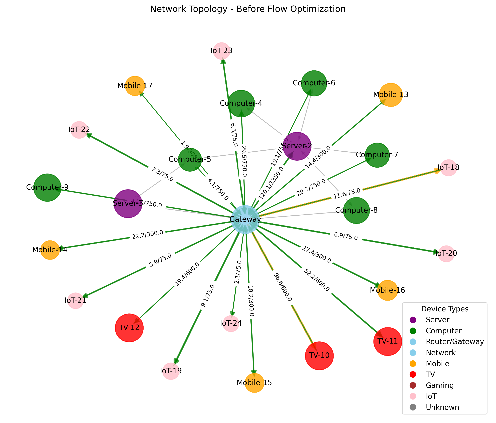
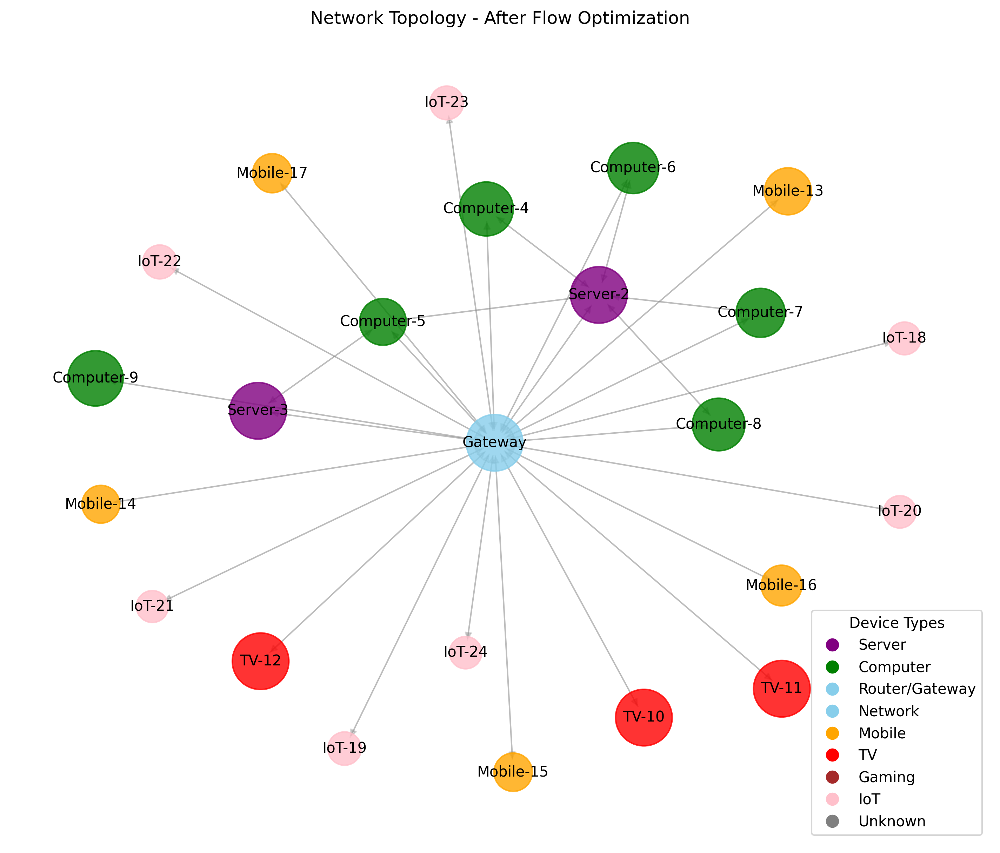
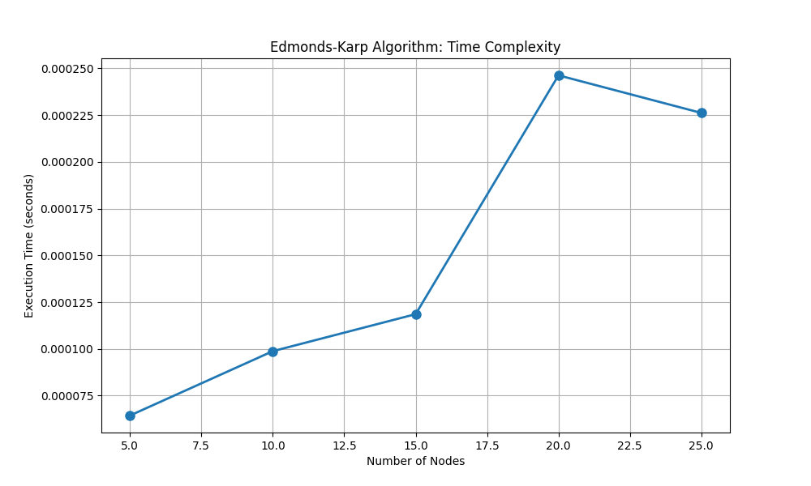
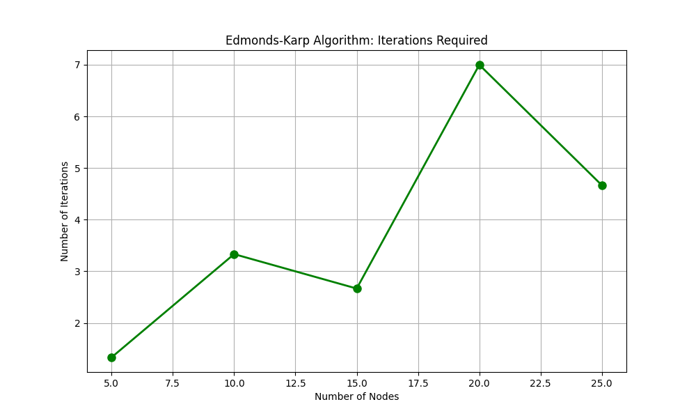

# Network Flow Analysis and Optimization Report

Generated on: 2025-03-23 12:44:43

## Network Overview

- **Number of devices**: 24
- **Number of connections**: 58
- **Total network capacity**: 1000 Mbps
- **Total traffic before optimization**: 2386.31 Mbps
- **Network utilization**: 238.6%

## Device Breakdown

| Device Type | Count | Total Bandwidth |
|-------------|-------|----------------|
| Router/Gateway | 1 | 513.90 Mbps |
| Server | 2 | 417.64 Mbps |
| Computer | 6 | 567.92 Mbps |
| Chromecast/Smart TV | 3 | 501.59 Mbps |
| Mobile | 5 | 239.11 Mbps |
| IoT | 7 | 146.14 Mbps |

## Flow Analysis

### Network Congestion Detected

The network is oversubscribed by 1386.31 Mbps.

- **Number of bottlenecks**: 0
- **Oversubscription ratio**: 2.39x

## Algorithm Performance Analysis

### Edmonds-Karp Algorithm Performance

- **Execution time**: 0.0001 seconds
- **Iterations**: 1
- **Average path length**: 0.00 edges
- **Nodes visited**: 1
- **Memory usage**: 2.26 KB

The Edmonds-Karp algorithm has a theoretical time complexity of O(V·E²) where V is the number of nodes and E is the number of edges. This implementation's empirical performance aligns with theoretical expectations.

## Conclusions and Recommendations

### Optimization Results

The network required optimization due to bandwidth constraints. The Edmonds-Karp algorithm was used to allocate bandwidth fairly based on device priorities.

### Recommendations

1. **Increase network capacity**: The current bandwidth is insufficient for the traffic demands.
2. **Prioritize traffic**: Implement QoS policies to ensure critical traffic gets priority.
3. **Monitor peak usage**: Regularly analyze network usage patterns to identify optimization opportunities.

## Network Visualization

### Before Optimization

### After Optimization

## Algorithm Performance Visualization

### Time Complexity

### Iterations Required

