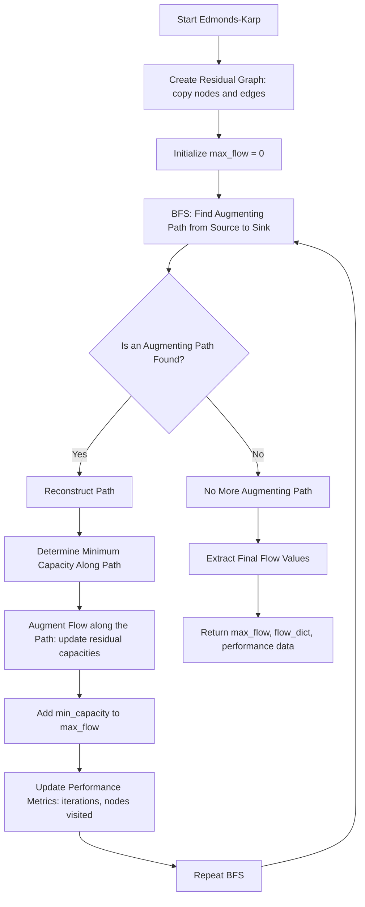

```mermaid
flowchart TD
    A[Start Edmonds-Karp]
    B[Create Residual Graph: copy nodes and edges]
    C[Initialize max_flow = 0]
    D[BFS: Find Augmenting Path from Source to Sink]
    E{Is an Augmenting Path Found?}
    F[Reconstruct Path]
    G[Determine Minimum Capacity Along Path]
    H[Augment Flow along the Path: update residual capacities]
    I[Add min_capacity to max_flow]
    J[Update Performance Metrics: iterations, nodes visited]
    K[Repeat BFS]
    L[No More Augmenting Path]
    M[Extract Final Flow Values]
    N[Return max_flow, flow_dict, performance data]
    
    A --> B
    B --> C
    C --> D
    D --> E
    E -- Yes --> F
    E -- No --> L
    F --> G
    G --> H
    H --> I
    I --> J
    J --> K
    K --> D
    L --> M
    M --> N
```