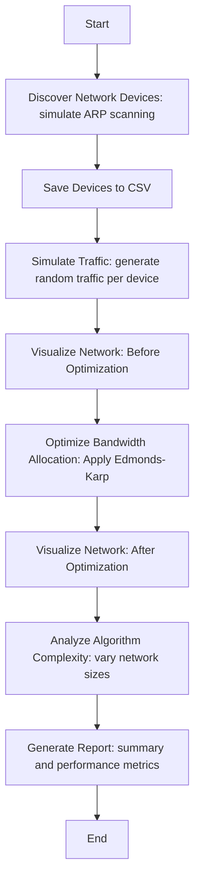

```mermaid
flowchart TD
    A[Start]
    B[Discover Network Devices: simulate ARP scanning]
    C[Save Devices to CSV]
    D[Simulate Traffic: generate random traffic per device]
    E[Visualize Network: Before Optimization]
    F[Optimize Bandwidth Allocation: Apply Edmonds-Karp]
    G[Visualize Network: After Optimization]
    H[Analyze Algorithm Complexity: vary network sizes]
    I[Generate Report: summary and performance metrics]
    J[End]
    
    A --> B
    B --> C
    C --> D
    D --> E
    E --> F
    F --> G
    G --> H
    H --> I
    I --> J
```